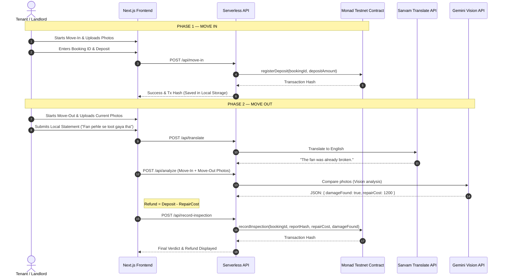

# 🛡️ Rent Chaukidaar
> **Trustless Rental Escrow & Damage Settlement Powered by Monad, Sarvam AI, and Gemini Vision.**

[](https://testnet.monadscan.com)
[](https://www.sarvam.ai)
[](https://ai.google.dev)
[](https://github.com)

---

## 📌 The Problem
In the Indian rental ecosystem, **security deposit disputes are a major friction point**. Landlords hold absolute veto power over the deposit. Upon move-out, tenants are often hit with unfair deductions for "damages" (which are frequently normal wear-and-tear or pre-existing issues). There is no unbiased, third-party source of truth.

## 💡 The Solution
**Rent Chaukidaar** is an AI-powered rental escrow registry that protects both parties by creating a cryptographically secure, auditable property lifecycle.

1. **Move-In**: The tenant uploads proof-of-condition photos. The security deposit registration is logged on the **Monad blockchain** under a unique Booking ID.
2. **Move-Out**: The tenant uploads checkout photos and optionally submits a statement in their preferred local language. 
3. **Sarvam AI** translates the local statement into English.
4. **Gemini Vision** compares the move-in and move-out photos to detect new damages and estimate repair costs.
5. **On-Chain Settlement**: The final report hash, repair cost, and damage status are committed to the Monad contract, recommending a trustless refund calculation.

---

## 🏗️ Architecture & Workflow



---

## 🛠️ Tech Stack

*   **Blockchain**: **Monad Testnet** (for high throughput, sub-second finality, and low transaction costs).
*   **Smart Contracts**: **Solidity** compiled and deployed using **Hardhat & Ethers.js**.
*   **Translation AI**: **Sarvam AI Mayura Translation API** (translating local languages into English).
*   **Vision AI**: **Gemini 1.5/2.5 Flash** (performing property condition comparisons with rigid JSON schema outputs).
*   **Frontend**: **Next.js 16 (Turbopack)**, **React 19**, and **Tailwind CSS v4** (styled using custom Pop-art / Neo-Brutalist themes).
*   **Image Compression**: Client-side **HTML5 Canvas Compression** (resizes and optimizes photos to base64, keeping localStorage under limits).

---

## 📦 Smart Contract Details
Deployed on **Monad Testnet** at address:
👉 **[`0xa374e501f6d65D0775F5136d496cddFD194db58a`](https://testnet.monadscan.com/address/0xa374e501f6d65D0775F5136d496cddFD194db58a)**

### ABI Signature Functions
```solidity
function registerDeposit(string calldata bookingId, uint256 depositAmount) external;
function recordInspection(string calldata bookingId, bytes32 reportHash, uint256 repairCost, bool damageFound) external;
```

---

## 🚀 Getting Started

### 1. Prerequisites
Ensure you have Node.js (v18+) and npm installed.

### 2. Configure Environment Variables
Create a `.env.local` file inside the `next-frontend/` directory:
```env
# Monad Configuration
MONAD_PRIVATE_KEY=your_private_key
NEXT_PUBLIC_REGISTRY_CONTRACT_ADDRESS=0xa374e501f6d65D0775F5136d496cddFD194db58a

# Gemini API Key
GEMINI_API_KEY=your_gemini_key

# Sarvam Translation API Key
SARVAM_API_KEY=your_sarvam_key
```

### 3. Installation
Install frontend dependencies:
```bash
cd next-frontend
npm install
```

### 4. Running Locally
Start the Next.js development server:
```bash
npm run dev
```
Open **`http://localhost:3000`** in your browser.

---

## 🛡️ Developer Safeguards
If you are running the project locally without API keys or Testnet balances, we've built-in a **Developer Bypass tool** directly on the Move-In and Move-Out screens. Clicking the bypass buttons will instantly simulate on-chain transaction logs and AI responses, allowing you to test the entire application interface and UX transitions effortlessly.
